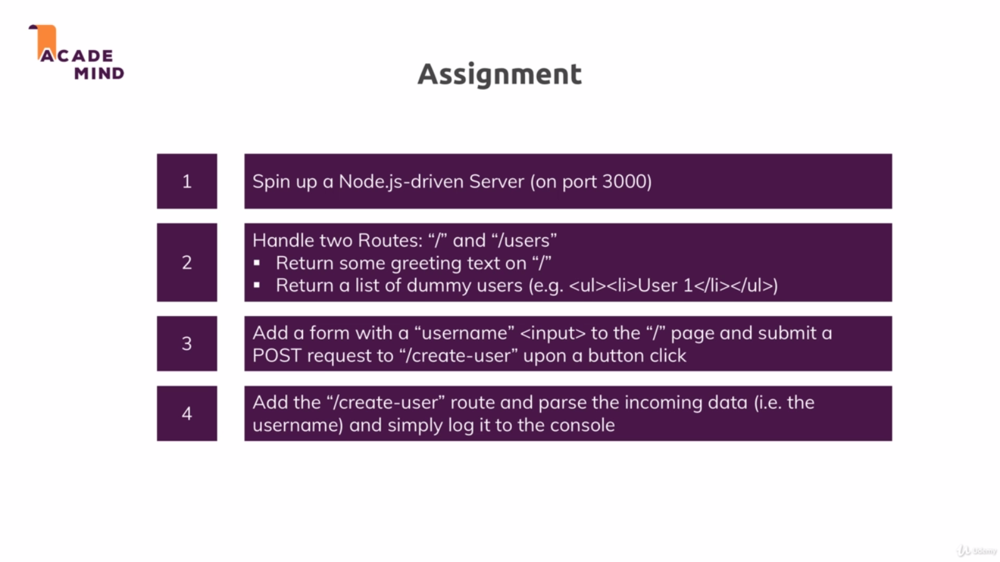

# Udemy-NodeJS-Complete-Guide
NodeJS - The Complete Guide (MVC, REST APIs, GraphQL, Deno)
# Node js Basics - Task 1
Create a new node js project 

    1. Spin up a Node js driven server (on port 3000)

    2. Handle two Routes "/" and "/users"
        * Return some greetings text on "/"
        * Return a list of dummy users (e.g. <ul><li>User 1</li></ul>)

    3. Add a form with a "username" <input> to the "/" page and submit a POST request to "/create-user" upon a button click

    4. Add the "create-user" route and parse the incomming data (i.e. the username) and simply log it to the console
    

    # Express JS - Task 2
    1. Create a npm project and install Express.js (Nodemon if you want)
    2. Create an Express.js app which funnels the requests through 2 middleware functions that logs something to the console and return one response.
    3. Handle requests to "/" and "/users" such that each request only has one handler / middleware that does something with it 
